# **Guesstimation Gaming Application**
## *Python* ~ *MySQL*

The Pycharm application offers two games to choose to play from: Hangman and  Photographic Memory Test

## **Application features**
### *User Accounts*
Allows users to create accounts, login or Play as a guest. The user ID and passwords are stored in MySQL.

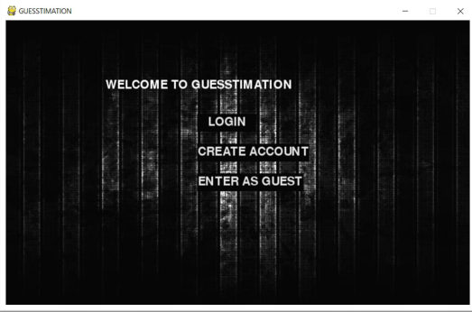   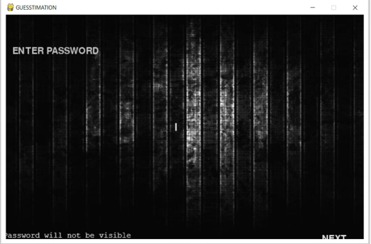 

### *Game 1: Photographic Memory Test*
Player is presented with 25 shape cards for a limited time, testing their photographic memory. This challenge is to identify and match the correct pairs in rcord time. A *how-to* page is displayed before the start of thee game.

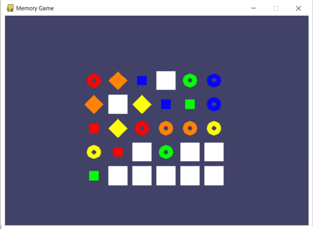      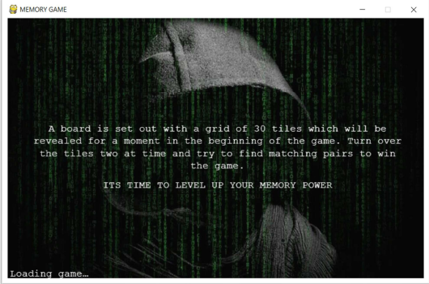

### *Game 2: Hangman- Movie and Series Edition*
Players must guess the correct movie or TV Show name. Hints can be opted if required. If identified correctly, the player wins, else looses. A *how-to* page is displayed before the start of the game.

The application was developed using PyCharm and MySQL was integrated to store user data and game statistics, ensuring a smooth user experience.

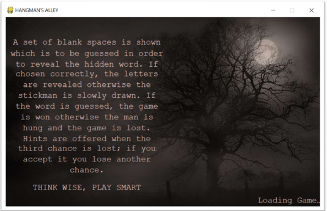      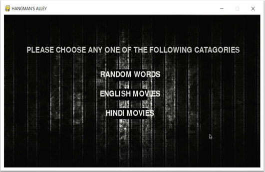      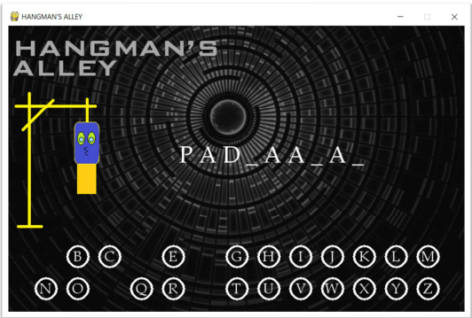

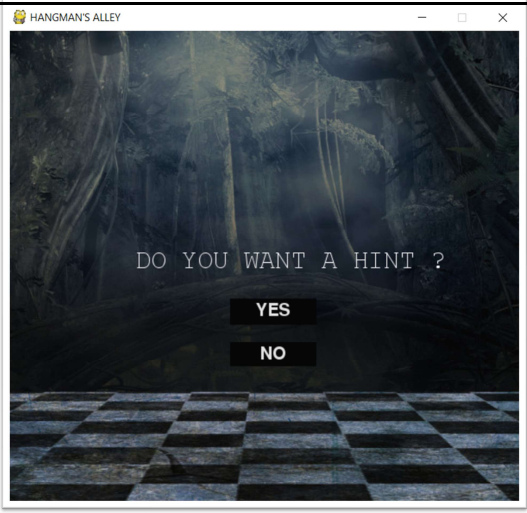     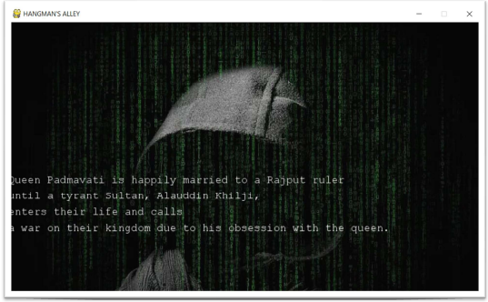 

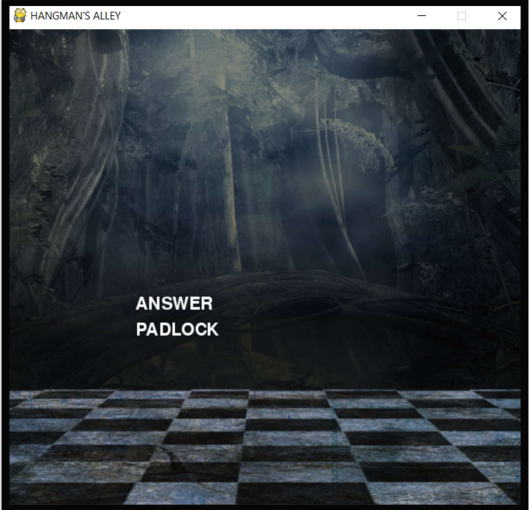     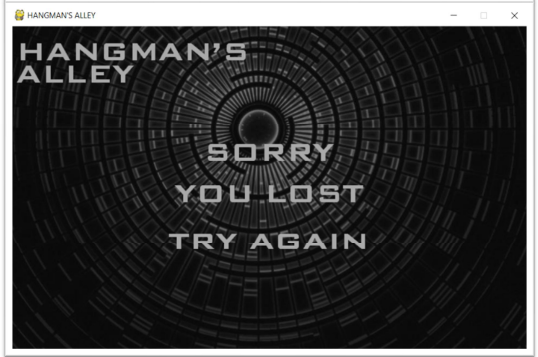        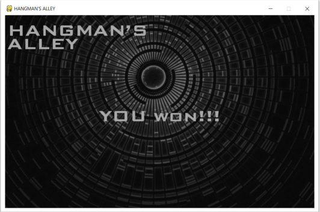

## Implementation
The application requires two primary python files: Main_program.py and hangman_words.py
The second file contains the database for the hangman game
-Ensure MySQL is properly installed and integrated with Python
-Ensure all the required packages are installed properly

## CONOPS: Concept of Operations

- *The flowchart for the whole application is given below*  
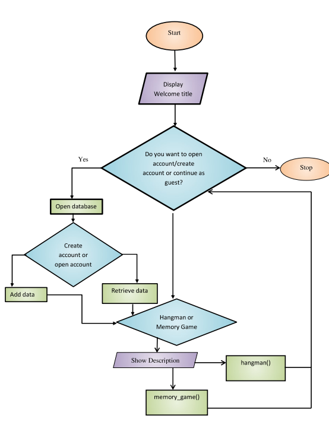

- *Hangman CONOPS*   
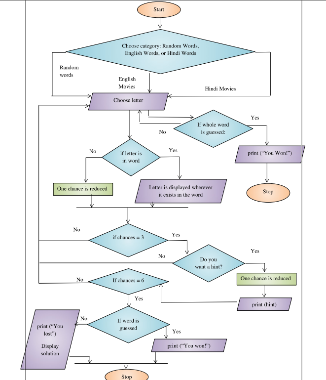

- *Memory Game CONOPS*   
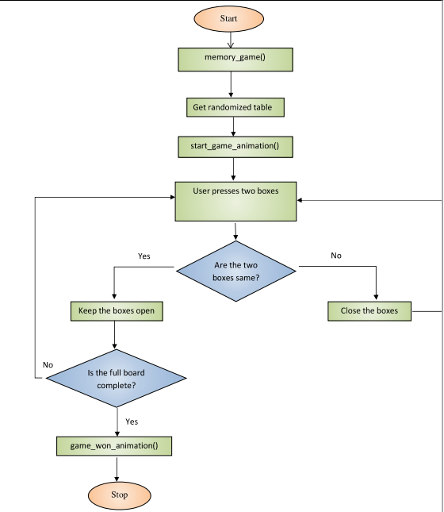 

